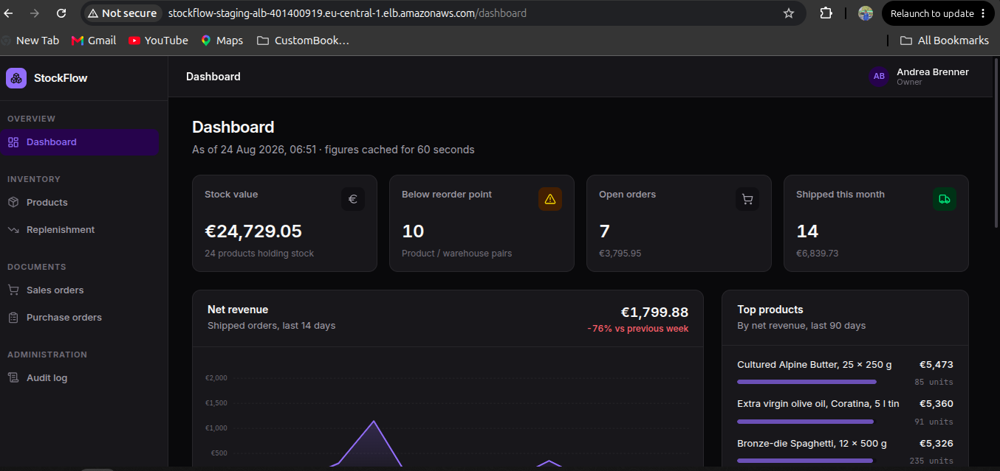
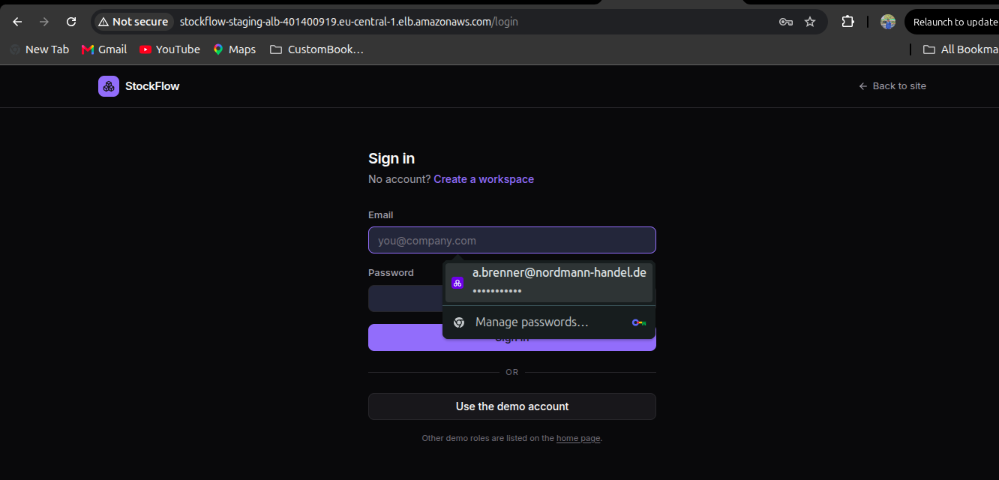
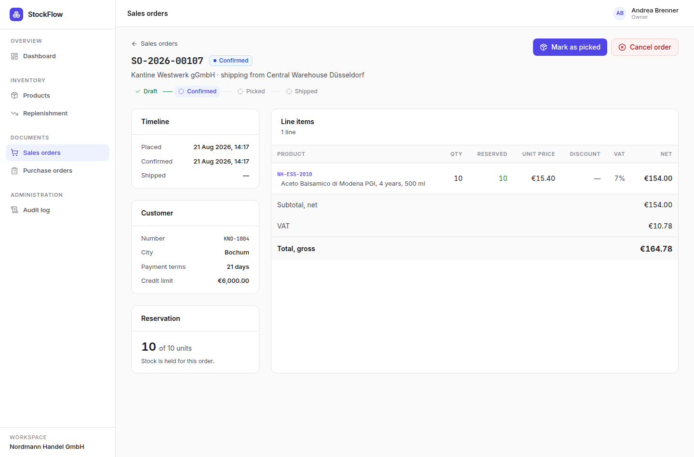
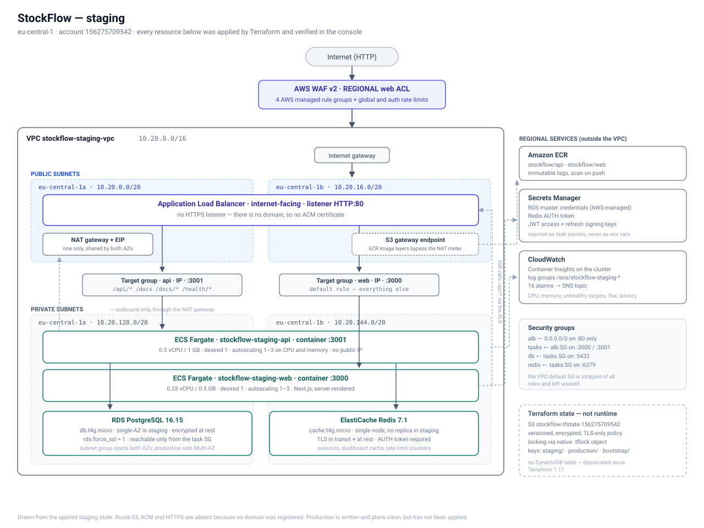
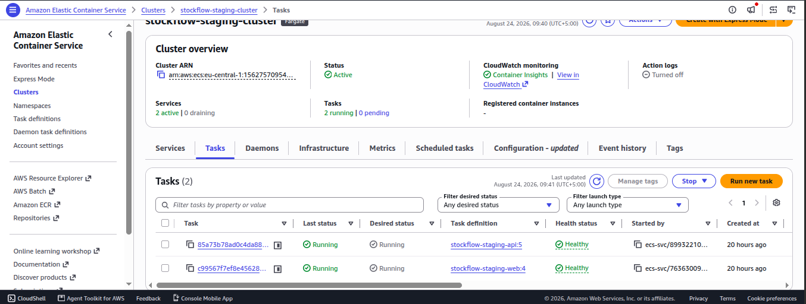
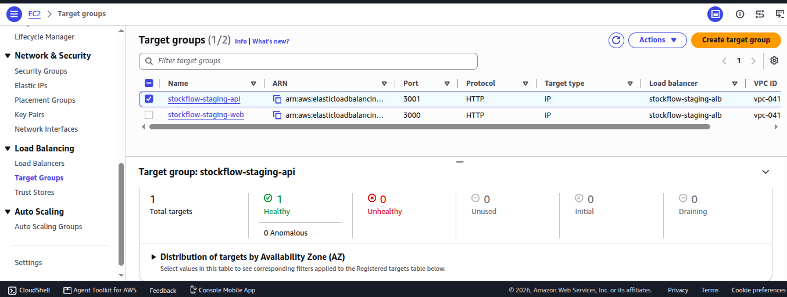
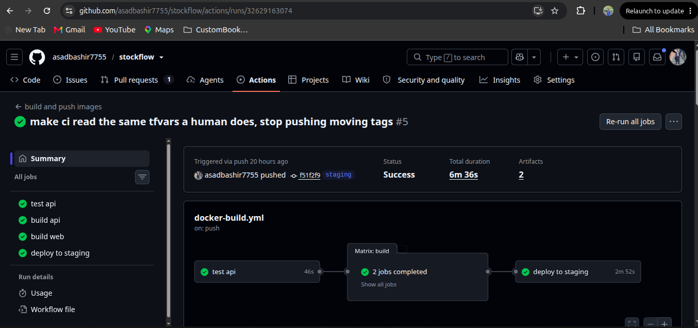

# StockFlow

Multi-tenant inventory and order management for a B2B wholesaler. Stock is
tracked as an append-only ledger, orders reserve stock before they ship, and
replenishment suggests what to reorder from which supplier.

Built as a portfolio project: a real application first, then the AWS
infrastructure to run it.

| | |
|---|---|
| **Backend** | NestJS 11, TypeORM, PostgreSQL 16, Redis 7 |
| **Frontend** | Next.js 15 (App Router), React 19, Tailwind |
| **Infrastructure** | Terraform, ECS Fargate, RDS, ElastiCache, ALB, WAF |
| **CI/CD** | GitHub Actions with OIDC — no static AWS keys |
| **Live?** | No — staging ran on AWS, was verified end to end, then torn down. A NAT gateway, an RDS instance and a load balancer bill by the hour. Screenshots proving it ran are below. |



The dashboard, served through the load balancer in `eu-central-1`.

## It ran on real AWS

Staging is torn down now, so these are what it looked like while it was up.
Every console screenshot is in [docs/aws-deployment.md](docs/aws-deployment.md).



The URL bar is the load balancer's own DNS name,
`stockflow-staging-alb-401400919.eu-central-1.elb.amazonaws.com`. HTTP rather
than HTTPS because no domain was registered, so there is no certificate. The
panel over the password field is the browser offering a saved login.



Order `SO-2026-00107`, confirmed: 10 of 10 units reserved and held for this
order, with on-hand untouched until it ships. VAT at the 7% food band — €10.78
on €154.00 net.



Drawn from the applied staging state, not from a plan.



`stockflow-staging-cluster` — two services, two Fargate tasks, both running and
healthy, on task definitions `stockflow-staging-api:5` and
`stockflow-staging-web:4`.



Both target groups behind `stockflow-staging-alb`: the API on port 3001 and the
web app on 3000. The API group has one target, healthy, none unhealthy.



A push to `staging` green end to end — tests, both image builds, then the deploy
that rolls the ECS services onto the new image.

## What it does

The demo tenant is *Nordmann Handel GmbH*, a specialty food and beverage
wholesaler in Düsseldorf with two warehouses.

- **Catalogue** — products with SKU, EAN, German VAT band, reorder point, per-supplier cost and minimum order quantity
- **Stock** — append-only movement ledger, running totals per product and warehouse, corrections require a reason
- **Sales orders** — draft → confirmed → picked → shipped, stock reserved on confirm and issued on ship
- **Purchase orders** — draft → sent → partially received → received, receipts post into the ledger
- **Replenishment** — what to reorder, rounded up to each supplier's minimum order quantity
- **Credit control** — confirmation checks the customer's limit against unpaid exposure
- **Access control** — four roles over 23 permissions, enforced per endpoint
- **Audit** — every write recorded with actor, action and redacted payload

## Run it locally

Requires Docker with Compose v2.

```bash
cp .env.example .env
docker compose up -d --build
docker compose exec api npm run migration:run
docker compose exec api npm run seed
```

Then open http://localhost:3000 and press **Open the live demo** on the landing
page — it signs you into the seeded workspace without typing credentials.

The seeder builds 90 days of trading history: ~110 sales orders, 8 purchase
orders, ~320 stock movements, from a fixed random seed so a reseed reproduces
the same data.

[Demo logins, migrations, tests and project layout →](docs/development.md)

## The code worth reading

Three things carry most of the weight, and each has tests behind it.

**The ledger** — [`inventory.service.ts`](apps/api/src/modules/inventory/inventory.service.ts).
`stock_movements` is the source of truth; `stock_levels` is a running total kept
so reads are one indexed row instead of a `SUM` over the journal. That makes it
a cache, so there is a reconciliation job that recomputes every total from the
ledger and reports the drift.

**Concurrent allocation** — [`allocation.e2e-spec.ts`](apps/api/test/allocation.e2e-spec.ts).
Confirming an order locks each `stock_levels` row `FOR UPDATE`, sorted by product
id. Without the lock two simultaneous confirms oversell; without the sort they
deadlock. The test fires ten concurrent confirms for six units each against ten
units of stock and asserts exactly one succeeds.

**Money** — [`money.ts`](apps/api/src/common/money/money.ts). Integer cents
throughout. VAT is rounded half-up once per line, because per-unit rounding
drifts on quantities like `3 × 3.33`, and order totals sum pre-rounded lines
rather than re-deriving VAT from the subtotal, which breaks the moment an order
mixes the 19% and 7% bands.

## Read more

| | |
|---|---|
| [docs/architecture.md](docs/architecture.md) | Why the ledger, the three quantities, concurrency, money, multi-tenancy, caching, idempotency, and the local and AWS topologies |
| [docs/aws-deployment.md](docs/aws-deployment.md) | The AWS build, with console screenshots of the deployed staging environment and the teardown |
| [docs/development.md](docs/development.md) | Demo logins, frontend notes, migrations, seeding, tests, project layout, configuration |
| [docs/issues-and-bugs.md](docs/issues-and-bugs.md) | Twelve things that broke while building this, and the known gaps that are deliberate |
| [infra/terraform/README.md](infra/terraform/README.md) | Terraform module layout, backend, and how to apply or destroy |
